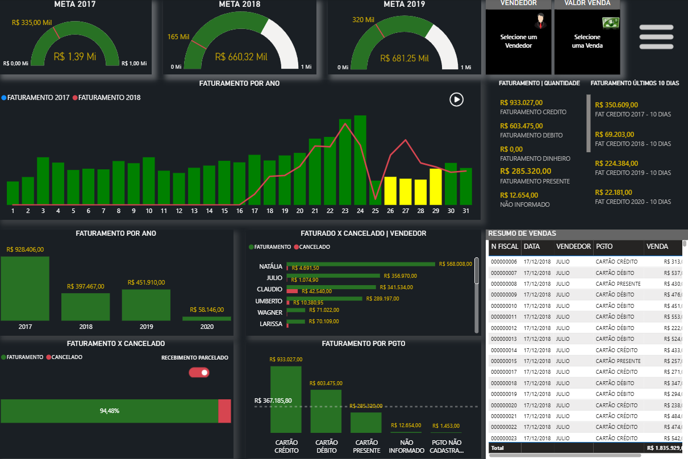
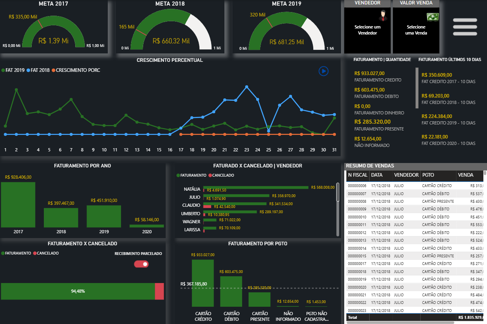
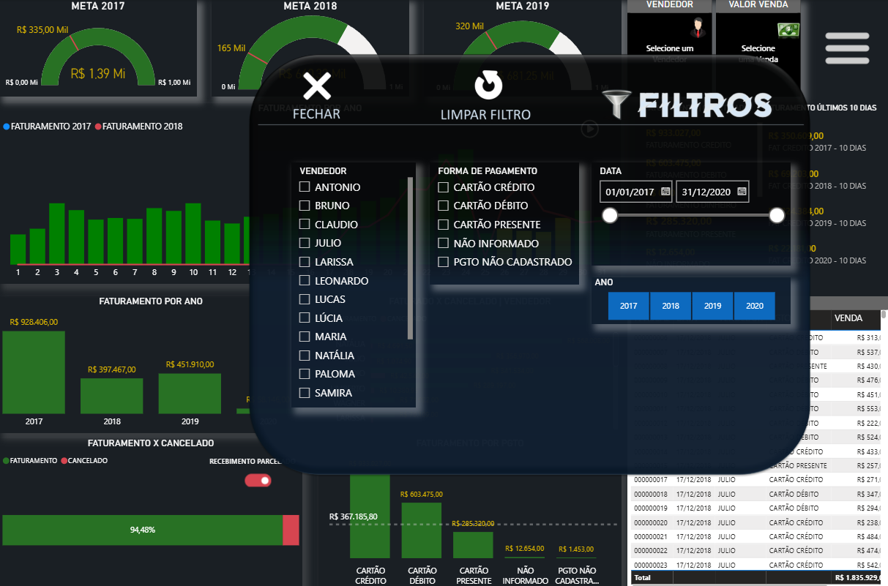
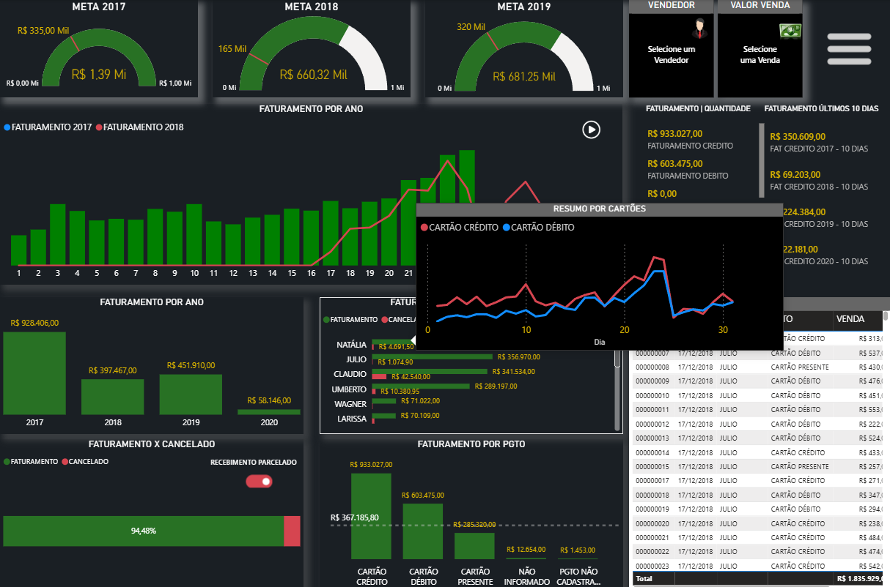
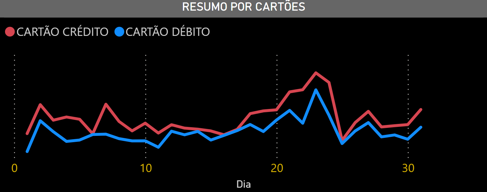

# 💰 Dashboard de Controle de Vendas — Power BI

## 📋 Sobre o Projeto
Dashboard analítico desenvolvido no **Power BI** para monitoramento e análise de vendas, faturamento e performance de uma empresa. O projeto centraliza informações de transações, formas de pagamento, metas e indicadores de desempenho em um painel interativo com navegação por abas, botões de ação, slicers dinâmicos e visuais customizados para análise em tempo real.

---

## 📊 Estrutura do Dashboard
O relatório é composto por **3 páginas**:

### 🏠 CAPA
Página de apresentação com identidade visual do projeto e botões de navegação para acessar o dashboard principal.
* **Botões de Ação:** Links interativos para navegação entre páginas
* **Imagem de fundo:** Personalização visual com branding corporativo

### 📈 RELATÓRIO DE VENDAS
Página principal com visão operacional completa, contendo:

* **Gráfico de Linha** — evolução de vendas ao longo do tempo
* **Gráfico de Colunas Clusterizado** — comparativo de vendas por período
* **Gráfico de Barras 100% Empilhado** — distribuição percentual de formas de pagamento
* **Gráfico de Barras Clusterizado** — análise comparativa de vendedores
* **Gráfico de Linhas com Colunas Combinadas** — sobreposição de faturamento e indicadores
* **Medidores (Gauges)** — visualização de KPIs com metas (3 medidores)
* **Cards de KPIs:** Total Faturamento, Faturamento 2019, Meta 2019, Cancelado, Crescimento %
* **Tabela Dinâmica** com dados detalhados de transações: N FISCAL, VENDEDOR, FORMA DE PAGAMENTO, RECEBIMENTO
* **Slicers dinâmicos:** Ano, Forma de Pagamento, Vendedor, com sincronização entre visuais
* **Toggle Switch Customizado** — seletor avançado para filtros
* **Imagens Temáticas** — visualizações auxiliares e ícones de navegação

### 🎯 TOOLTIP
Página auxiliar com:
* **Gráfico de Linha** — detalhes complementares para tooltips e análises adicionais

---

## 🗄️ Modelagem de Dados

### Tabelas utilizadas
| Tabela | Descrição |
|--------|-----------|
| `CALENDARIO` | Tabela dimensão de datas com hierarquia temporal (Ano → Trimestre → Mês → Dia) |
| `CONSOLIDADA` | Tabela fato principal — registros de transações de vendas |
| `FORMAS PGTO` | Tabela dimensão com agregações de formas de pagamento |
| `MEDIDAS` | Tabela de medidas DAX centralizadas com cálculos e metas |

### Principais colunas — `CONSOLIDADA`
| Coluna | Tipo | Descrição |
|--------|------|-----------|
| N FISCAL | Texto | Número fiscal/documento de venda |
| VENDEDOR | Texto | Identificação do vendedor |
| FORMA DE PAGAMENTO | Texto | Método de pagamento utilizado |
| RECEBIMENTO | Numérico | Data/valor de recebimento |

### Principais colunas — `CALENDARIO`
| Coluna | Tipo | Descrição |
|--------|------|-----------|
| DATA | Data | Data completa do evento |
| Ano | Numérico | Ano extraído |
| Hierarquia de datas | Hierarquia | Navegação temporal (Ano, Trimestre, Mês, Dia) |

### Principais colunas — `FORMAS PGTO`
| Coluna | Tipo | Descrição |
|--------|------|-----------|
| FAT CREDITO | Numérico | Faturamento em cartão crédito |
| FAT DEBITO | Numérico | Faturamento em cartão débito |
| FAT DINHEIRO | Numérico | Faturamento em dinheiro |
| FAT PRESENTE | Numérico | Faturamento em vale presente |
| QTDE CARTAO CREDITO | Numérico | Quantidade de transações crédito |
| QTDE CARTAO DEBITO | Numérico | Quantidade de transações débito |
| QTDE DINHEIRO | Numérico | Quantidade de transações dinheiro |

---

## 📐 Medidas e Cálculos DAX

| Medida | Descrição |
|--------|-----------|
| `FATURAMENTO` | Soma total de todas as vendas |
| `FAT 2017` | Faturamento específico do ano 2017 |
| `FAT 2018` | Faturamento específico do ano 2018 |
| `FAT 2019` | Faturamento específico do ano 2019 |
| `meta 2018` | Meta de faturamento para 2018 |
| `meta 2019` | Meta de faturamento para 2019 |
| `CRESCIMENTO PORC` | Crescimento percentual entre períodos |
| `CANCELADO` | Total de transações canceladas |
| `Máximo` | Maior valor de transação |
| `Mínimo` | Menor valor de transação |
| `FILTRO VENDA` | Filtro dinâmico para vendas |
| `FILTRO VENDEDOR` | Filtro dinâmico para vendedores |

---

## 🛠️ Tecnologias e Recursos

* **Power BI Desktop**
* **DAX** — medidas, cálculos de metas e crescimento
* **Power Query (M)** — transformação e tratamento de dados de vendas
* **Hierarquias de Datas** — navegação temporal (Ano → Trimestre → Mês → Dia)
* **Visuais Customizados:**
  - Advanced Toggle Switch (filtro interativo)
  - Medidores (Gauges) para KPIs
  - Table Ex para tabelas avançadas
* **Slicers Sincronizados** — Ano, Forma de Pagamento, Vendedor
* **Botões de Ação** — navegação e interatividade entre páginas
* **Tema Visual** — CY26SU05 com paleta corporativa
* **Imagens de Fundo** — personalização por página (CAPA, menu, vendedor, dinheiro)
* **Drill-down habilitado** nos gráficos temporais para análises detalhadas

---

## 📊 Principais Análises Possíveis

✅ **Faturamento por Período** — Análise temporal de vendas com comparativos mensais, trimestrais e anuais  
✅ **Performance de Vendedores** — Identificar top performers e rankings de venda  
✅ **Análise de Pagamentos** — Distribuição de formas de pagamento (Dinheiro, Crédito, Débito)  
✅ **Metas vs Realizado** — Visualizar progresso contra metas com medidores interativos  
✅ **Crescimento e Cancelamentos** — Monitorar taxa de crescimento e transações canceladas  
✅ **Ticket Médio** — Calcular valor médio das transações por período/vendedor  
✅ **Análise de Recebimento** — Acompanhar cronologia de recebimentos  

---

## 🚀 Como Visualizar

1. Faça o download do arquivo `CONTROLE_DE_VENDAS.pbix`
2. Abra com o **Power BI Desktop** (gratuito — [download aqui](https://powerbi.microsoft.com/pt-br/desktop/))
3. Navegue pelas páginas: **CAPA → RELATÓRIO DE VENDAS → TOOLTIP**
4. Clique nos botões de ação para navegar entre seções
5. Utilize os slicers para filtrar por ano, forma de pagamento e vendedor
6. Interaja com os medidores, gráficos e tabelas para explorar dados em detalhe
7. Ative o drill-down nos gráficos de linha para análises temporais granulares

---

## 💡 Diferenciais do Projeto

🎨 **Design profissional** com layout moderno e navegação intuitiva via botões de ação  
🔄 **Toggle Switch Customizado** para filtros avançados e interatividade aprimorada  
📊 **Medidores (Gauges)** para acompanhamento visual de metas vs realizado  
🔗 **Slicers Sincronizados** que se atualizam mutuamente para análises eficientes  
⚡ **Performance otimizada** com cálculos DAX bem estruturados  
📈 **Múltiplas perspectivas** — temporal, por vendedor, por forma de pagamento  
🎯 **KPIs estratégicos** — faturamento, crescimento, cancelamentos, metas  

---

## 👨‍💻 Autor
Feito com 💙 por **Juan Almeida**

---

## 📝 Notas

* Projeto desenvolvido com dados fictícios para fins educacionais e de portfólio
* Modelo de dados preparado para fácil integração com sistemas reais de vendas
* Dashboard pronto para adaptação a diferentes estruturas comerciais
* Suporta atualizações automáticas de dados via conexão dinâmica com fontes externas
* Medidores e metas são parametrizáveis conforme necessidade do negócio
